# Shadowsocks 笔记


**Call for help**

I want to translate the article into english, but my english and time limit me. 

I will be appreciate if you can make your contribution on this project if you have interests.

Thank you.

> 时间会遗忘的。
  * [前言](#前言)
    + [经典思路](#经典思路)
    + [新思路](#新思路)
  * [Shadowsocks](#Shadowsocks)
    + [一些历史事件](#一些历史事件)
      - [风云突变](#风云突变)
      - [一些话](#一些话)
      - [SSR之死](#SSR之死)
  * [传承](#传承)
  * [变数](#变数)
    + [收紧的手](#收紧的手)
    + [时间线](#时间线)
    + [小心翼翼](#小心翼翼)
  * [新生代](#新生代)
    + [Surge --- 破局者](#Surge-----破局者)
      - [题外话](#题外话)
    + [Shadowrocket --- 小火箭](#Shadowrocket-----小火箭)
    + [Others](#Others)
    + [Android](#Android)
      - [Clash for Android](#Clash-for-Android)
      - [Postern](#Postern)
  * [总结](#总结)
  * [后记](#后记)
- [个人搭建指南](#个人搭建指南)
  * [服务器选择](#服务器选择)
  * [服务器系统](#服务器系统)
  * [Shadowsocks-libev](#Shadowsocks-libev)
      - [obfs 混淆](#obfs-混淆)
    + [Shadowsocks-libev 安装与配置](#Shadowsocks-libev-安装与配置)
  * [Shadowsocks客户端](#Shadowsocks客户端)
    + [Windows](#Windows)
      - [下载地址](#下载地址)
      - [本地配置](#本地配置)
    + [macos](#macos)
      - [Shadowsocks-NG](#Shadowsocks-NG)
      - [ClashX](#ClashX)
      - [Surge](#Surge)
    + [iOS](#iOS)
      - [Surge](#Surge-1)
      - [Shadowrocket](#Shadowrocket)
    + [Android](#Android-1)
      - [Shadowsocks](#Shadowsocks-1)
      - [Postern](#Postern-1)

## 前言

中国国家防火墙（非官方）是管理中国出入境网络流量的一套软硬件系统的集合，其被中国网民戏称为中国防火长城（Great Firewall， GFW）。长期以来，由于 GFW 的存在，在中国大陆境内无法访问 Google，Twitter，Facebook 等境外网站，因为能够定向屏蔽境外网站，GFW 事实上将互联网划分为了中国大陆内网与境外互联网两种互联网体系。在大多数情况下，“墙” 会被用来代指 GFW。

翻越 GFW 有很多种方法，大浪淘沙，很多的方法都已经消失了，在我能够想起来的过去的，现在的，做一简单的记录：

### 经典思路

1. 修改电脑内部的 host 文件：通过自主指定相关网站的 IP 地址，避开 DNS 以达到翻墙的目的，这种方法最为简单粗暴，但依然存在，同时存在相关的软件项目定期更新 host 列表；
2. 强制指定系统DNS：GFW 主要攻击手段之一是 DNS 污染，于是便有了强制指定系统 DNS 的方式以避免返回无效 IP 地址，这种方法经常会结合 1 使用；
3. VPN：原本用来作为一种匿名，安全，保密的 VPN 服务也被发掘出翻墙的潜力，其原理比较简单，选择一个没有被 GFW 封杀的服务器，通过该服务器将相关网站的流量转发到自己的设备，而设备与VPN服务器之间的通信并不在GFW的屏蔽范围之内，于是便达成了翻墙的目的。VPN 最初的目的是用于企业服务，方便员工远程登录企业内网进行操作，主要协议有 PPTP、L2TP、IPsec、IKEv2、openVPN 等等；
4. GoAgent，自由门，fqrouter 等一系列网络服务；

### 新思路
4. Shadowsocks 类：主要包括各类 Shadowsocks 衍生版本，ShadowsocksR，Shadowsocks-libev等，特点是加密了通信过程中的数据以及流量分流；
5. 内网穿透：比较典型的是 [ZeroTier](https://www.zerotier.com)，建立一个中继的管理服务器，加入服务器的客户端相当于处于同一个局域网中，不仅可以翻墙，由于其虚拟内网的特性，可以实现局域网内多设备联动。ZeroTier 有一个公有的服务器，官方称之为 Earth，同时用户可以自建 ZeroTier 中继服务器，官方称之为 Moon。
6. V2Ray：V2Ray 是 Project V 下的一个工具。Project V 是一个包含一系列构建特定网络环境工具的项目，而 V2Ray 属于最核心的一个。官方介绍 Project V 提供了单一的内核和多种界面操作方式。内核（V2Ray）用于实际的网络交互、路由等针对网络数据的处理，而外围的用户界面程序提供了方便直接的操作流程。不过从时间上来说，先有 V2Ray才有Project V；如今 V2Ray 的开发者已经失联，V2Ray 的开发维护工作基本上已经陷入停滞。
7. 大杀器：奇怪的名字，似乎是一个有趣的人开发的，个人没有关注过。

## Shadowsocks
### 一些历史事件
2012年4月22日，V2EX 用户 clowwindy 分享了一个自己自用一年多的翻墙工具：**Shadowsocks**
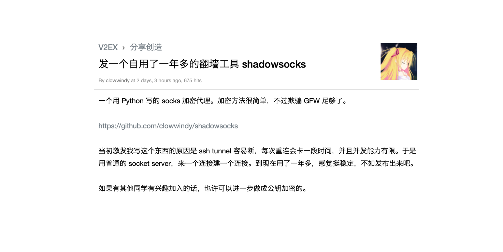

在日常中，当我们谈到 Shadowsocks (Shadowsocks)，实际上指的是围绕 Shadowsocks 所建立起来的一套完整的翻墙组件，其中包括了 Shadowsocks 协议，Shadowsocks  服务端，Shadowsocks 客户端。然而本质上，狭义的 Shadowsocks 是一套加密协议，被加密后的网络数据隐匿了目标地址与内容特征，使得 GFW 无法对我们期望的流量进行污染或者拦截，从而实现网络自由。传统的 VPN 技术的主要目的是保证数据安全，降低敏感数据泄漏的风险，因此，当开启 VPN 之后，所有的流量都会通过 VPN 通道进行传输，这意味着无需代理的网络流量也会被转发到远程的 VPN 服务器，即使个人建立了 VPN 通道，也难以避免网络访问效率上的下降，同时也难以避免版权内容在服务器 IP 所在地区无法播放的情况。

相对于传统的 VPN 技术，Shadowsocks 的建立初衷便是为了翻墙，因此 Shadowsocks 接管网络之后，并不会对所有的流量进行加密处理，通过引入配置文件（PAC）实现了网络分流技术，也就是配置文件中的网站走代理通道，配置文件之外的地址全部走直连通道，一个客户端，两套出口，互不干扰，极大的提升了上网体验。

初生的 Shadowsocks 点燃了开发者的热情，基于各类语言的 Shadowsocks 实现与主流平台的客户端如雨后春笋一般很快建立起来了，这是一段热情而又喧闹的时期，参与在其中的人们毫不吝惜自己的聪明才智与旺盛精力，围绕 Shadowsocks 这个内核与骨架，每个人都在努力作出自己的贡献。彼时，传统而又相对成熟的 VPN 业务足以应对不成熟的 GFW，Shadowsocks 只不过是刚刚萌发的幼芽，脆弱而生机勃勃，默默吸收着养分，等待着时机的爆发。

最初的 Shadowsocks 客户端都内置了节点信息，网上也有人分享自己的节点，虽然速度略慢，稳定性不佳，但丰俭由人，普通用户安装后无需额外配置即可食用，有需求有技术的群体可以在自己的服务器上搭建 Shadowsocks 服务。唯一遗憾的是当年的 iOS 上并没有网络通道的权限，要么使用 Shadowsocks 浏览器有限翻墙，要么越狱安装客户端接管网络，实现 Shadowsocks 代理。

#### 风云突变
**2015年8月20日**，clowwindy 在 GitHub 发出如下一段话：

>Two days ago the police came to me and wanted me to stop working on this. Today they asked me to delete all the code from GitHub. I have no choice but to obey.
>
>I hope one day I’ll live in a country where I have freedom to write any code I like without fearing.
>
>I believe you guys will make great stuff with Network Extensions.

>Cheers!

当晚，clowwindy 把他所维护的几个 shadowsocks 代码仓库内的 Isuesses 面板全部关闭，所有帮助信息全部删除，并将所有的描述都改成了 Something happened。于此同时，他还清空了这些仓库 / 组织的 membership，或者将所有成员全部转入隐私状态，不对外公开。

空气中弥漫着不寻常。

**2015年8月21日** 网络上开始传出 clowwindy 被请去喝茶的消息，稍后 clowwindy 在 shadowsocks-windows 的 #305 issue 下回复道
>I was invited for some tea yesterday. I won’t be able to continue developing this project.

同时他也开启了 twitter 的隐私保护功能，除已关注者外，其他人无法查看他的动态；
当晚 clowwindy 发布了 thanks. 后的推文，证明人没事。
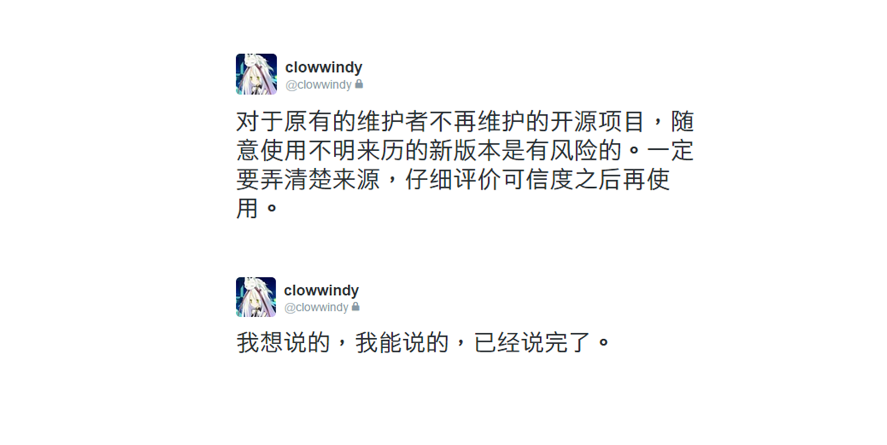

至此，Shadowsocks 原作者退出。

#### 一些话
clowwindy 的遭遇并未完全消灭所有开发者的热情，因此后续的开发维护工作并未停止，在这段不安的时间里，前前后后也着实发生了很多的事情，乱花渐欲迷人眼，前因后果在此不计。

ShadowsocksR 的作者 breakwa11 是一个极富争议性的人，她接手了后续 Shadowsocks的开发工作，却违反开源协议封闭源代码，同时发布的过程中暗示自己是原作者，在 [shadosocks-windows/Issue108](https://github.com/shadowsocks/shadowsocks-windows/issues/293#issuecomment-132253168) 中 clowwindy 做出了一些回应：

>那是自然的咯。这边加了什么功能，它（SSR）马上扒过去合并了。它那边加了什么却不会贡献出来给其他人用，久而久之，不就是它那边功能更多了吗。

>一直以来我什么都没说是因为我对他还有点希望，所以得给他一点面子不是。一开始我还只是纳闷他为什么不发 pull request，过了一段时间我才明白，这个世界上也有这一类的人。不尊重 GPL 就算了，把作者名字换成自己的，还在主页上加上官方的字样。为什么我们这边反而不说官方呢？因为我希望这个项目是没有官方的，人人都是贡献者。想不到这个社会人人都围着官转，人人都巴不得当官 。

>既然他没有尊重别人劳动成果的意愿，那他那些不开源的理由想必也只是借口。说因为加了一些试验性功能会不兼容所以暂不开源。他弄了一个混淆 TCP 协议头功能，在界面上标注提升安全性，吸引用户打开，然后安装他自己的不兼容服务端。然而我分析了一下之后发现这个功能的设计就是想当然，用得多了以后反而会增加特征。如果你真有什么试验性功能，不是更应该开放出来让所有人帮你分析么，大家一起讨论么？在加密算法领域，只有经过足够多人和机构的审视的算法，才能视作是安全的，闭门造出来的怎么能用。。

>当然啦，大部分用户才不会管这些，他们不会分析你是不是真的安全，也不会做道德判断，只要他们觉得好用就行。所以可以看到，这种环境下开源其实并没有什么优势，只不过为一些人抄袭提供了便利。这种环境下最后留下来的都是这些人。

>我一直想象的那种大家一起来维护一个项目的景象始终没有出现，也没有出现的迹象。维护这个项目的过程中，遇到 @chenshaoju 这样主动分享的同学并不多。很多来汇报问题的人是以一种小白求大大解决问题，解决完就走人的方式来的，然而既不愿提供足够的信息，也不愿写一些自己尝试的过程供后人参考。互帮互助的气氛就是搞不起来。对比下国外的社区差好远。

>最适合这个民族的其实是一群小白围着大大转，大大通过小白的夸奖获得自我满足，然后小白的吃喝拉撒都包给大大解决的模式。通过这个项目我感觉我已经彻底认识到这个民族的前面为什么会有一堵墙了。没有墙哪来的大大。所以到处都是什么附件回帖可见，等级多少用户组可见，一个论坛一个大大供小白跪舔，不需要政府造墙，网民也会自发造墙。这尼玛连做个翻墙软件都要造墙，真是令人叹为观止。这是一个造了几千年墙的保守的农耕民族，缺乏对别人的基本尊重，不愿意分享，喜欢遮遮掩掩，喜欢小圈子抱团，大概这些传统是改不掉了吧。

>现在维护这些项目已经越来越让我感到无趣。我还是努力工作，好好养家，早日肉翻吧。

值得反思。

#### SSR之死

争议始终是存在着的，但是这也未曾阻挡 SSR 前进发展的步伐，越来越多的人开始转向 SSR，SS 逐步落入下风，但是也有一批拥促。平静的水面下隐藏着汹涌的暗流，爆发的那一刻已然迟已，开发者 breakwa11 的遭遇不论真假，同样令人胆寒

2017年7月19日，breakwa11 在 Telegram 频道 ShadowsocksR news 里转发了深圳市启用 Shadowsocks 协议检测结果，被大量用户转发，引发恐慌。

2017年7月27日，breakwa11 遭到自称 "ESU.TV" 的不明身份人士人身攻击，对方宣称如果不停止开发并阻止用户讨论此事件将发布更多包含个人隐私的资料，随后 breakwa11 表示遭到对方人肉搜索，而被他们所公开的个人资料属于完全无关人士，是自己当时随便填写的信息，为了防止对方继续伤害无关人士，breakwa11 决定删除 GitHub 上的所有代码、解散相关交流群组，停止 ShadowsocksR 项目。他在 Telegram 发出以下这段话：

>这次的人肉事件，让我严重怀疑我自己做 SSR 是不是对的，首先不管资料对不对，从行为上看，就是有人希望我死，希望这个项目死，恨一个人能恨到如此程度。我知道我很做作，因此得罪了很多人，尤其最近公开 Shadowsocks 可被检测的问题，更是让很多人义愤填膺，非要干掉我不可。尽管从我的角度看，我只是希望通过引起关注然后促进 Shadowsocks 那边进行修改，这并不是希望 Shadowsocks 死掉的意思，我每次提出的问题之后不是都得到了改进了吗，包括 OTA 和 AEAD，AEAD 我也是有参与设计的，你们可以问 Syrone Wong，以及 NoisyFox 证实，而且 Shadowsocks-windows 有一部分也是我参与修改的。但如今，人肉的资料我也稍微看了一下，真是太令人心寒，连对方的支付宝流水都拉出来了，这样真的好吗？我并不希望因为我自己的问题而害了另一个人。我期望和那些反对我的人来一笔交易，我可以以停止开发 SSR 作为交换，删除项目及相关的东西，以后不再出现，SSR 群从此解散，账号注销，删除代码。对于我来说，这个项目不过是我用来证实自己的想法的一个东西，可有可无，制作也只是兴趣，扔掉也没有什么可惜的，反正替代品非常多，根本就不缺我这一个。你们老说我圈粉，你们真想太多了，真没这个必要。如果可以以这个换取另一人免受网络暴力，我也觉得这是值得的。相反的，如果人肉的结果仍然公开了，那就是我的行为已经救不了了，那我就可以继续开发 SSR。不过也不会太久，估计最多只多坚持一年到我毕业之前。谢谢这两年来大家的支持，这次应该是真正的和大家再见，看结果吧，今天晚上 12 点以 SSR 群解散作为标志，如果解散了那就正式和大家说一声再见

当然12点，breakwa11 解散了 Telegram 群组。

至此，SSR 作者退出。

##  传承

clowwindy  与 breakwa11 的遭遇与随后的退出，其实在暗示着 GFW 的成长，它不仅仅是技术上的博弈，它的概念开始扩展至更广泛的领域，技术永远都是有漏洞的，但与此同时，开发者也是。奔涌的潮水会退回去，但下一次，下一次，它依然会积蓄着力量汹涌而来。


得益于 clowwindy 最初开源 Shadowsocks 的决定，大量的 fork 使得 Shadowsocks 依然在更新之中，从 GitHub 现有结果来看，各个平台（甚至是路由器）的 Shadowsocks 仍然不断的在更新，在提交 IShadowsocksue，也有大功能更新，每一滴微小的力量都推动着项目的前进，只是前途在何处仍然是未知数。

## 变数

###  收紧的手

2017年7月底，中国区 App Store 多款 VPN 相关应用在无任何说明与通知的情况下，突然集体被下架，与正常下架流程不同的是，过去苹果官方下架的应用一般可以在用户的已购项目中仍然可以下载，这是对已经购买了该应用的用户权益的保障，而这次的下架直接封杀了国行 App Store 所有渠道的下载，性质显然不同于以往，苹果给出的回应是：

> 我们已经收到要求，在中国移除一些不符合规范的 VPN App。这些 App 在其他市场的运营则不受影响 

此次下架回应中所谓的规范即是2017年1月工业和信息化部印发的《关于清理规范互联网网络接入服务市场的通知》，《通知》中明确表明：

> 规范的对象是未经电信主管部门批准，无国际通信业务经营资质的企业或个人，租用国际专线或VPN，私自开展跨境的电信业务经营活动。外贸企业、跨国企业因办公自用等原因，需要通过专线等方式跨境联网时，可以向依法设置国际通信出入口局的电信业务经营者租用，《通知》的相关规定不会对其正常运转造成影响。 

受此影响，大量的用户只能与开发者联系，不少开发者只能通过 TestFlight 对用户分发更新，但是由于 TestFlight 分发的 app 90天后就会失效，开发者一旦弃更，用户便无法再使用该软件，此种风险也使得不少用户注册了外区的 Apple ID 并重新购买应用。由于工信部要求备案，且个人无备案资格，基本上表明了此次被下架的应用无法再上架，此次的风波也受到了国际社会的广泛关注与批评，唯一算作欣慰的是，苹果在下架软件的同时，倒逼政府出台了相应的明确细则。

2017年10月，伴随着十九大的开幕，大量线路被封杀，尤其以 SSR 为甚，各大机场与 tg 群一片哀嚎，所幸大会闭幕后不少 IP 被解封，不清楚具体的比例。

2018年1月，以及接下来的两会期间，执行了更大规模的 IP 封杀，涉及范围更广，基于各种算法的翻墙方法均有涉及，Shadowsocks 的 Issues 中有用户反映刚刚搭好十几分钟即被封杀。

2018年9月30日，公安部下发[通知](http://www.mps.gov.cn/n2254314/n2254409/n4904353/c6263180/content.html)

> 《公安机关互联网安全监督检查规定》已经2018年9月5日公安部部长办公会议通过，现予发布，自**2018年11月1日**起施行。 

### 时间线

#### 2019/04/25

2019年4月25日，河南省新密市人民检察院发出[公告](http://www.ajxxgk.jcy.gov.cn/html/20190425/1/9344870.html ):

> 2019年3月25日，新密市人民检察院依法以提供侵入计算机系统工具罪对孙东洋提起公诉，案件正在进一步办理当中。 

2019 年 5 月 31 日，河南省新密市人民法院依法作出判决：

> 被告人孙东洋......，使用家中电脑通过租用境外（美国、日本）服务器创建网站，非法在网站上出售“翻墙”程序软件账号及引导使用教程，有486人购买孙东洋出售的“翻墙”程序软件账号，借助该软件运用通讯加密和混淆技术手段，绕过和突破国家对国际互联网的网络安全技术防护措施（系统），可以访问被国际互联网网络安全技术防护措施屏蔽和过滤的境外网站及其他互联网应用、服务 ......

*孙东洋即逗比根据地网站主创办人SSR，2018年11月失联。*

#### 2019/05/14

Shadowsocks 一键安装脚本先驱秋水逸冰在 twitter 上发推：

> 斟酌再三，还是觉得已经没有继续坚持下去的必要了。 不如就此告别，后会有期。 [https://teddysun.com/548.html ](https://t.co/AfkNolQGgd) 

​											
长期关注无线路由器相关固件的恩山论坛上，lean，hiboy，荒野无灯，abccba94 等多名重要维护者宣布退出。

#### 2019/09/16 - 2019/09/xx

国家网络安全宣传周，大量的机场出现大规模节点被封的情况，个别机场的 ip 甚至全数被封。Twitter 上有人反映甚至出现平常仅使用 Shadowsocks 进行网络学习的服务器被封的情况。  

###  小心翼翼

网传的一份联通客户端对于各个协议的识别情况：

| 软件和协议                 | 联通检测类型                                        | 访问网址     |
| -------------------------- | --------------------------------------------------- | ------------ |
| Shadowsocks                | TCP 业务                                            | 显示服务器IP |
| Shadowsocks + http_simple（80端口） | 上网 (Web方式get)                                   | 显示混淆域名 |
| SSR                        | TCP 业务                                            | 显示服务器IP |
| SSR + http_simple          | 上网 (Web方式get)                                   | 显示混淆域名 |
| SSR + TLS(443)             | * 安全类网页浏览 (HTTPS VPN) 流量 <br/>* HTTPS 链接 | 显示混淆域名 |
| SSR + TLS(995)             | 安全协议的收邮件流量                                | 显示IP       |
| SSR + TLS(非443)           | * 网络连接（网页）<br/>* HTTPS 链接                 | 显示混淆域名 |
| OpenConnect                | UDP 业务                                            | 显示服务器IP |
| IPSec VPN                  | UDP 业务                                            | 显示服务器IP |
| V2Ray                      | TCP 业务                                            | 显示服务器IP |
| V2Ray + TLS                | HTTPS 网络连接                                      | 显示证书域名 |
| nghttpx + TLS              | HTTPS 网络连接                                      | 显示证书域名 |
| kcptun                     | UDP 业务                                            | 显示服务器IP |

*注：由于这份资料真假未知，仅做分享，请勿有不必要的恐慌。*

##  新生代

所有的主流平台中，iOS 是比较特殊的，不仅是因为它对权限管理相当的严格，更多的是因为没有相关的网络 API，开发者也是巧妇难为无米之炊。直到 iOS 9 苹果才对开发者开放 VPN 相关的 Network Extension 权限，在此之前，iOS 用户只能在越狱环境下才能获得相对完整的 Shadowsocks 体验，App Store 仅有一款 Shadowsocks 浏览器，只能实现浏览器内翻墙。毫不夸张地说，相对于 Android，此时的 iOS 在翻墙领域仍处于蛮荒时代。

####  Surge --- 破局者

Surge 出生于 iOS 平台，带着枷锁跳舞，其思路打破了之前 Shadowsocks 圈内的桎梏，再次促进了 Shadowsocks 代理软件生态的发展。

最初的 Surge 定位于网络调试工具，作者本人写了一个 Shadowsocks module 实现了 Shadowsocks，也许作者本人的想法并不是翻墙，所以该 module 从开始就是一个黑箱，且长时间没有支持 V2Ray 等新型协议，直至 2019 年和 2020 年才分别加入了对 V2Ray 与 Trojan 的支持。另外，Surge 于 2019 年起添加了对其自研闭源协议 Snell 的支持，并于2020年发布了该协议的 v2 版本。无心栽柳柳成荫，通过使用 Network Extension 建立 VPN 通道，Surge 可以接管 iOS 设备网络，实现全局代理，网络分流，并且 Surge 的稳定性非常好，68 的售价并没有挡住人们热情的购买力，网络上逐渐开始出现关于 Surge 的讨论，使用教程乃至付费共享。

无论站在当时还是现在的角度来看，Surge 的模式非常具有开创性：

  1. 新生的 Surge 在 UI 设计与用户体验上，还是相对比较简陋的，但是作者同时引入了以文本 config 的形式对软件进行设置，摆脱用户界面的同时也赋予了用户比较高的自由度；
  2. Surge 定位为网络调试工具，当它接管设备的网络之后，可以获取到设备的网络访问信息，通过单独设置设备对某网络信息的响应模式（主要包含了 proxy，direct，reject 3种核心模式），可以实现网络分流，阻止响应，阻止发送等功能，经由网友们的一番探索，最终实现了指定代理地址，屏蔽广告，解析视频地址等功能，堪称完美。

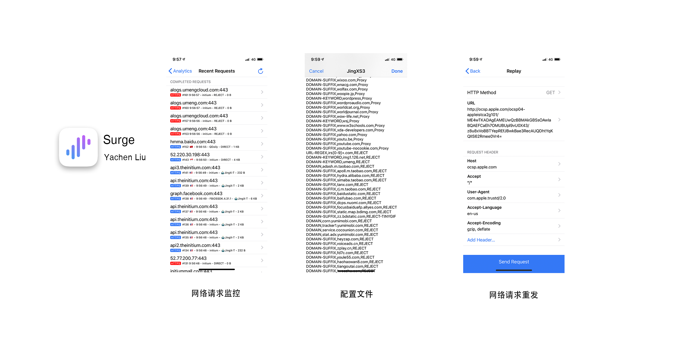

##### 题外话

Surge 固然好，但是其开发者 Yachen Liu 却着实是一个富有争议的人，整理的 Surge 时间线如下：

- 2015年10月26日 Surge 以68元的售价上架 App Store；

- 2015年11月29日 Yachen Liu 自称被喝茶；

- 2015 年 12 月 4 日 ，Surge App Store **全区下架**，之后又以648元的高价短期上线，作者解释为方便已购买用户更新；

- 2016 年 3 月，Surge iOS 2.0 版本发布，承诺 648 元**永不降价**，同时启用反盗版策略，180天内仅能激活十台设备；

- 2016 年 8 月，Surge Mac 2.0 版本发布，iOS 版本价格调整为 328元，作者解释 648 元为 macOS 与 iOS 双版本价格，价格调整是售卖策略发生变化；

- 2017年5月，Surge 限时8折；

- 2018 年 1 月，iOS Surge 3 发布，根据老用户购买时间提供免费升级和优惠升级，同时提升反盗版策略，7天内仅能激活3台设备；

- 2018年10月，作者发推表示

  > 计划给 Surge iOS 加一个新功能，可以选择将自己的授权与 iCloud 账号绑定，绑定后最多可激活 6 个设备，但是仅可以在自己的 iCloud 登录的设备上使用。 

作者确实是网络技术大牛，截至目前，Surge 仍然是iOS端最优秀的 Shadowsocks 客户端，但是其营销策略极富争议性，喝茶事件至今无法证实，且之后全区下架客户端也毫无道理，之后长期上架 App Store 也不能很好的自圆其说，因此被称为喝茶营销 （仅作记录，不代表个人观点）。

作者对高价的解释是 Surge 是面向国际的网络调试设备，主要竞品是老牌应用 Charles，但是这几年的发展下来，调试功能这种核心并没有实质的长进，反盗版能力，UI设计倒是提升不少，口嫌体直般升级了 Shadowsocks 的最新版本， ~~ 却死活不肯添加 V2ray 等新协议，~~ 面向国际的软件，核心用户却是国内用户，可以说是相当的傲娇。

即使面临大量的争议，Surge 仍然是 iOS/macOS 领域内，最具有创新力的网络软件之一，良好的用户体验与创新的功能也为 Surge 带来了大量的拥簇。
#### Shadowrocket --- 小火箭

Surge 下架上架来回折腾的时候，不少开发者也看到了机遇，Shadowrocket 便是当时的 Surge 追随者，最初上架性能虽然不佳，但是 6 元的售价并且兼容 Surge 规则还是吸引了不少人下载，一时间风头无两，被称为小火箭。

最初小火箭比较简陋，随着快速的迭代更新，小火箭功能逐渐完善起来，稳定性也提高了不少，在摆脱 Surge 的同时，小火箭也开发出了不少让人眼前一亮的新功能。

与 Surge 不同，小火箭的初衷就是为了翻墙，所以作者直接就内置了各种翻墙协议，通过UI界面非常容易添加和修改，作者也针对国内的环境开发出了场景模式，按需求连接，服务器订阅等模式，同时作者在[Telegram](https://t.me/ShadowrocketApp)上创建了群组，用户之间的交流以及开发者的反馈速度很快。

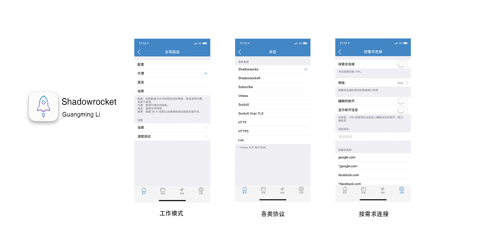

现在的小火箭可以说已经尽善尽美了，作者更新的频率大大降低，但是仅仅 \$2.99 元的售价显得非常的亲民。

2020 年 12 月 2 日，根据 Apple 所公布的 2020 年公布的应用下载数据，Shadowrocket 为 2020 年度付费应用下载量第 9 名，考虑到国区 App Store 已经下架了 Shadowrocket，而其目标用户又大多是国人，取得如此的成绩着实亮眼。

#### Others

iOS上还有A.BIG.T，Potatso等VPN软件，16年，17年与小火箭战的难舍难分，无奈后劲不足，现在大概是明日黄花了。

[Quantumult](https://itunes.apple.com/us/app/quantumult/id1252015438#?platform=iphone) 是新近崛起的一款代理软件，$4.99 的售价可以实现 Surge 的大部分功能，支持多种协议，相较于小火箭又多出了抓包功能，测试规则更方便，同时，Quantumult 扩展了规则中的屏蔽性能，使得屏蔽广告更有针对性。

（2021/01）Quantumult 的更新已经陷入停滞，目前作者的主要精力均放置在 Quantumult X，相较于 Quantumult，功能更加强大以及多样，网络上也有更多的资源可以参考。

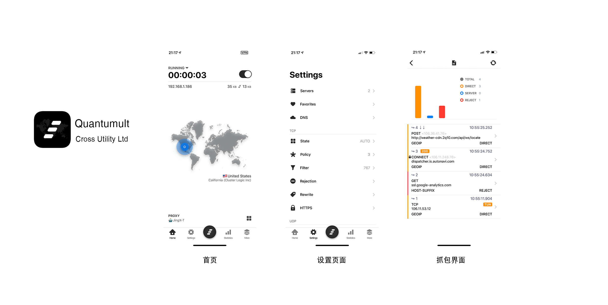

#### Android

Android 平台因为其自由开放的特性，使得各类 VPN 应用均能找到对应的用户群，因此 Shadowsocks 客户端的发展最初比较缓慢，较为完善的基础客户端仅有 Shadowsocks，但是其仅提供了分流代理功能，并不能实现广告拦截等功能。随着时间的推移，越来越多的开发者参与到开源社区的建设中，也伴随着机场托管，订阅的发展，Android 也涌现出越来越多的优秀应用。只不过受限于个人精力，并没有对更多的应用保持关注。

##### Clash for Android

Clash for Android 是 Android 平台上的一款开源 Clash 客户端，其界面简洁，美观，支持机场订阅，托管，经过多次的迭代之后，基础功能已经相当的完善，性能表现稳定，能够满足大多数人的日常使用。

项目地址：[GitHub](https://github.com/Kr328/ClashForAndroid)

下载地址：[GitHub](https://github.com/Kr328/ClashForAndroid/releases) | [Google Play](https://play.google.com/store/apps/details?id=com.github.kr328.clash)

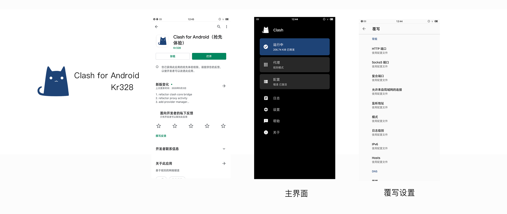

##### Postern (个人并不推荐)

**2021 年 1 月更新：Android 上已经有不少的优秀应用了，考虑到 Postern 在 Google Play 上最近的一次更新是 2018 年 10 月 7 日，无论是功能，用户体验，稳定性，个人对该 APP 不做推荐，文章中仅作为记录。**

Postern是在 Android 上最接近于 Surge 模式的软件，其可以兼容 Surge 规则，直接将 Surge 的配置文件导入即可使用，整体功能也算中规中矩，但是 Postern 的 UI 相对简陋，作者对此的解释是：

> 很多Postern用户抱怨软件UI的问题，确实UI比较简陋。主要是Postern是从Linux下一堆C代码演化过来的，刚开始并没有任何UI只有命令行，开发者只求运行稳定快速。我也希望能强化UI，不过无奈主业实在太忙，最近更是几乎没有时间维护。仅就今后尽量改进吧。 

截止目前（2019/03/12），Postern Android 版仍未支持混淆，SSR 之后兴起的新型加密格式也未获得支持，如果有相关的需求可以尝试，对于一般人来说也许 shadowsocks 更为合适些。Postern 可以在 Google Play Store 获取，同时 Postern 的 Github 中包含了[说明手册](https://github.com/postern-overwal/postern-stuff)，从 Github 的文件来看，作者同时也放出了 Mac 版的安装包(个人并不推荐)，在 iOS 美区也可以购买 iOS 版 (个人并不推荐)。

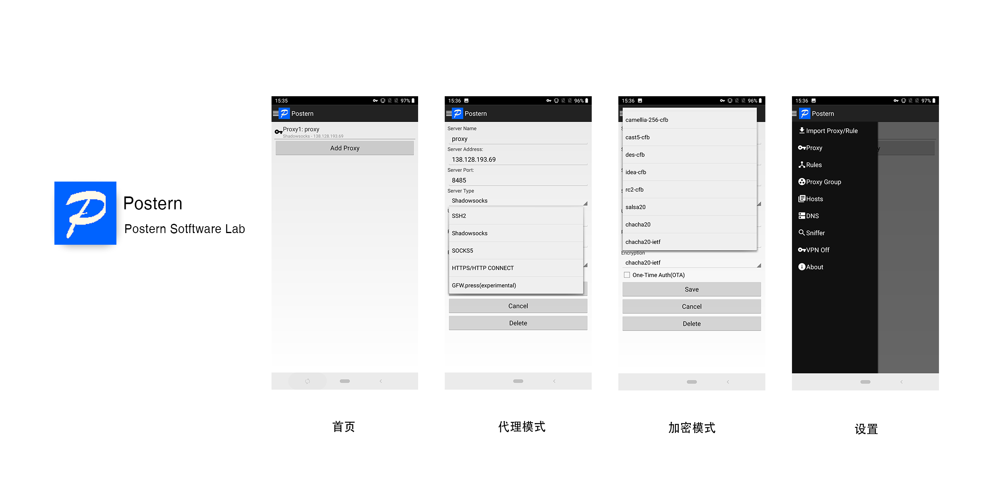

##### 评论
根据 [Issue #7](https://github.com/KeiKinn/ShadowsocksBio/issues/7)，@Mosney 根据自己的经验，提出了多个平台上的新兴 App 与应用，现做摘录如下：
> Android：
之前在hockyapp上公测的Surfboard，现在也已经在play商店发布1.0版本，唯一的劣势可能就是配置文件独树一帜。
Clash for Android也已经注册play商店超前体验，UI很漂亮，clash内核提供更广泛的兼容性。
Android还有一些我没用过的客户端，ClashA等。

> Windows：
目前个人感觉Clash for Windows日臻完善。

>Others：
另外目前x86机器做路由实现网关透明代理似乎也越来越流行，其中大部分是用的现有的Shadowsocks+OpenWrt luci插件作为前端方案，还有少部分是用的clash+luci界面，据我所了解目前也有几个开发者在维护适用于OpenWrt的软件包或分支。

#### 总结

总体来看，得益于 Surge 的开创性思路，iOS 端的代理软件一度诸侯林立，逐鹿中原，相关软件的讨论也是层出不穷，是一段相当甜美的蜜月期。随着政策的逐渐收紧，潮水退去，国区内基本上已经没有太多的选择，蛰伏至外区的软件们随着各类原因或离开或留下，如今天下大势已定，或许很难比较各自的用户数量，但几大软件已经有了稳定的核心用户群，Surge 还在稳扎稳打走着自己的路，Shadowrocket 与 Quantumult 的开发已经陷入停滞，新入门的代理软件仍需在夹缝中找寻自己的位置。

喧闹过后，一片白茫茫大地。

## 后记

并未经历过墙垒砌的时间段，那段时间的我并不足以对世界产生认知，当高墙矗立，互联网缩小成了局域网，我慢慢才明白所有的一切都陷入了疯狂。得益于各个开发者孜孜不倦的努力与付出，像我这种普通人才真正接触到了互联网，感叹于各个网站，各个博客之间的信息分散，内容相互交叉重叠，大多数人在实现目标后也就弃之而去，再加上这些年自己也尝试了不少的软件与上网方法，一点一点拼凑了这篇文章，并未有他想，只是希望作为一个小传留存下来，随着时间的推移，这篇文章迟早会成为历史的尘埃。

这篇文章洋洋洒洒写了很多，圄于个人知识，能力所限，难免有所遗漏与错误，还望大家海涵。

## 喝杯奶茶🍵

不知不觉得这个项目已经坚持了相当长的一段时间，能够将这段历史书写出来也是非常的开心呢～～ 

因为某些原因目前暂时还在家待业，如果你认为这个项目对你有所帮助，欢迎大家打赏一下以资鼓励。


# 个人搭建指南

## 服务器选择

一般来说，VPS的虚拟化技术主流为 OpenVZ 与 KVM 架构，从各种资源以及 Shadowsocks 服务支持上，建议选择 KVM 架构的机器，以下所有的说明都是基于搬瓦工 KVM 建构的机器。

## 服务器系统

服务器建议安装带有BBR技术的Linux系统，TCP BBR 拥塞控制算法由 Google 开发，并提交到了 Linux 内核，从 4.9 开始，Linux 内核已经用上了该算法。根据以往的传统，Google 总是先在自家的生产环境上线运用后，才会将代码开源，此次也不例外。根据实地测试，在部署了最新版内核并开启了 TCP BBR 的机器上，网速甚至可以提升好几个数量级。

搬瓦工的机器可以在控制面板 ---> install new os ---> centos-7-x86_64-bbr，快速更换系统，注意备份服务器上的数据。


## Shadowsocks-libev

随着技术发展，Shadowsocks与墙之间的交锋也是一次比一次激烈，据传说，即使是Shadowsocks的256位加密，运营商可以做到解密，监视Shadowsocks使用者的上网流量，真实性未知，但小心点总不会错。

目前有4个衍生版本的Shadowsocks:

1. Shadowsocks-go: 二进制编译, 轻量, 快速
2. Shadowsocks-python: 无功无过，也是最原始的版本，近年来更新速度略慢
3. Shadowsocks-libev: 一直处于更新之中，最大的特点是支持obfs混淆
4. ShadowsocksR: 从作者到产品都极负争议性, obfs混淆模式开创者, 但是前一段时间SSR服务器普遍遭到GFW的封杀. 

现阶段为了能在安全与速度之间取得平衡，我个人更加推荐使用 Shadowsocks-libev + obfs混淆。

#### obfs 混淆

obfs 混淆最大的作用是对 Shadowsocks 流量进行伪装, 在不添加obfs的情况下, 运营商服务器通过的流量为未知的加密流量, 据说 GFW 已经有一定的包检测的能力, 仅仅加密流量具有一定的风险, 添加 obfs http 模式之后, 通过运营商的流量会被识别为设定好的网址的流量, 假设你设定的是 bing, 那么你的 Shadowsocks 流量会被判别为你当前正在访问 bing, 减少了被封杀的可能性，**tls模式安全性高于http模式**。

之前流量不是无限的时代, 因为只有运营商的 APP 可以无限使用流量, 比如什么天翼视讯, 利用 obfs 混淆, 可以将你的手机流量伪装为天翼视讯的流量, 从而达到无限使用使用流量, 这种操作太骚, 实测可以成功, 不过还是低调的好.

### Shadowsocks-libev 安装与配置

请注意，随着时间流逝，以下教程必然会过时，因此仅作为个人服务器搭建的参考。

安装图省心推荐秋水逸冰的[一键安装脚本](https://teddysun.com/357.html)

**请注意，秋水逸冰已经宣布放弃继续维护该脚本，因此该脚本可能随时会失效**

1. 使用 root 用户 SSH 登录

   ```shell
   wget --no-check-certificate -O shadowsocks-all.sh https://raw.githubusercontent.com/teddysun/shadowsocks_install/master/shadowsocks-all.sh
   chmod +x shadowsocks-all.sh
   ./shadowsocks-all.sh 2>&1 | tee shadowsocks-all.log
   ```

2. 跟随提示选择相对应的模式即可

   1. 加密方式推荐 **chacha20-itef-poly1305**, 
   2. 端口可以尽量设置高一点,避免443, 1080等常用端口, 
   3. **安装 simple-obfs , 选择 http 模式**

   安装成功后会有如下提示:

   ```shell
   Congratulations, your_shadowsocks_version install completed!
   Your Server IP        :your_server_ip
   Your Server Port      :your_server_port
   Your Password         :your_password
   Your Encryption Method:your_encryption_method
   
   Your QR Code: (For Shadowsocks Windows, OSX, Android and iOS clients)
   ss://your_encryption_method:your_password@your_server_ip:your_server_port
   Your QR Code has been saved as a PNG file path:
    your_path.png
   
   Welcome to visit:https://teddysun.com/486.html
   Enjoy it!
   ```

   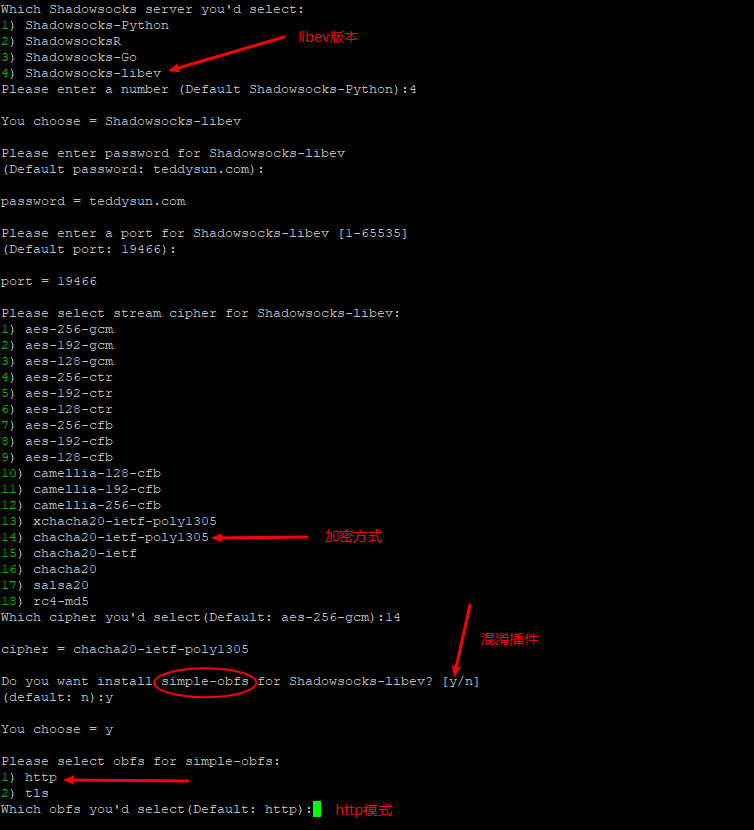

3. 卸载

   使用root用户登录

   ```shell
   ./shadowsocks-all.sh uninstall
   ```

4. 常用命令

   ```shell
   启动：/etc/init.d/shadowsocks-libev start
   停止：/etc/init.d/shadowsocks-libev stop
   重启：/etc/init.d/shadowsocks-libev restart
   查看状态：/etc/init.d/shadowsocks-libev status
   ```
   
5. 配置文件地址
   ```shell
   //etc/shadowsocks-libev/config.json
   ```
## Shadowsocks客户端

Shadowsocks 客户端已经全平台覆盖了, Github 上有专门的开源客户端项目.

### Windows

#### 下载地址

- [Win Shadowsocks客户端下载地址](https://github.com/shadowsocks/shadowsocks-windows/releases)
- [Shadowsocks obfs-local插件下载地址](https://github.com/shadowsocks/simple-obfs/releases)

#### 本地配置

服务器端已将安装了 obfs, 本地端直接下载obfs-local插件, 解压后**将插件 obfs-local 与Shdowsocks.exe 同一路径下**即可.

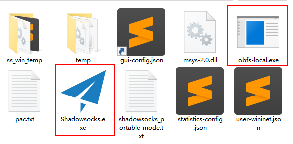

obfs可以直接在Shadowsocks的服务器编辑页面修改参数

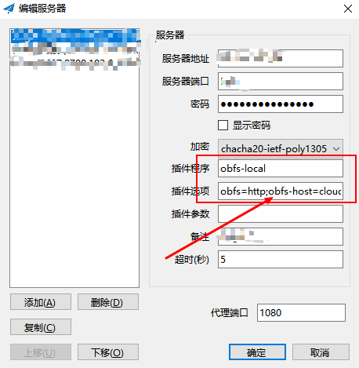

插件选项为 **obfs=http;obfs-host=www.bing.com**, 实际上可以将 www.bing.com 更换为任意的一个网址, 只要不是被GFW封杀的就可以, 推荐像腾讯视频, 优酷, bing这种流量较大的网站, ~~如果填写是Google或者YouTube, 活着不好么......~~


### macOS

~~macOS上的Shadowsocks客户端目前似乎还是不支持obfs混淆.~~
2018/10/06更新
#### Shadowsocks-NG

GitHub上存在好几种Mac客户端，使用最广的是Shadowsocks-NG，目前的版本中已经支持obfs混淆，并且已经直接集成于客户端之中，无需额外下载，按照windows的设置填写参数即可。


- [Shadowsocks-NG 下载地址](https://github.com/shadowsocks/ShadowsocksX-NG/releases)

#### ClashX

最近出现了一个新的类Surge软件，ClashX，目前还在快速迭代期之中，兼容 Surge 的 config 文件，基本上对其稍作修改便可以导入 ClashX 中使用。可以去官方[ Telegram 群](t.me/clash_discuss)参与讨论

类Surge软件的核心都在于config文件，在Shadowsocks网络分流的基础上，对不同的流量产生不同的行为，可以实现指定网址代理，广告屏蔽等效果，自由度更高。

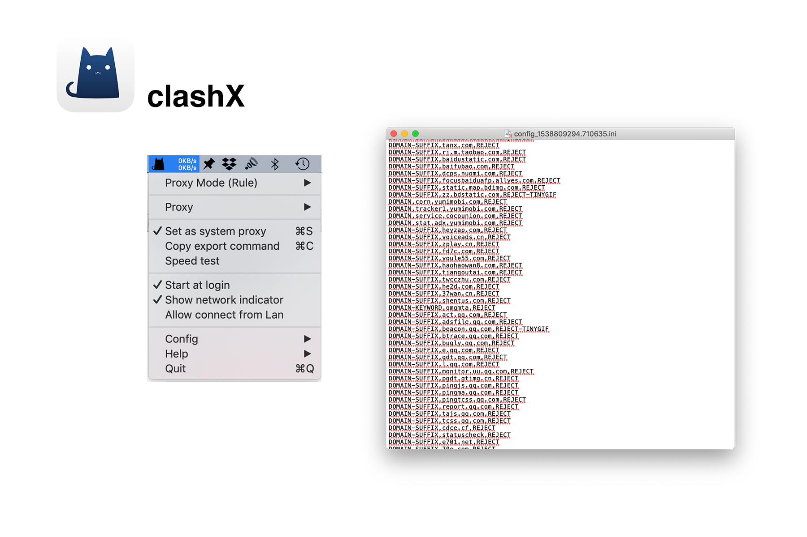

- [ClashX 下载地址](https://github.com/yichengchen/clashX/releases)

#### Surge

支持obfs混淆，在3.0版本中加入了全新的rule-set模式，config的管理从本地可以完全移至云端，不同的rule-set对应不同的应用规则，更容易管理，~~只可惜没钱截图😂~~

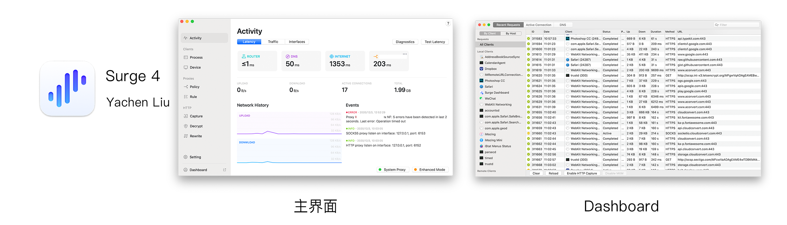

### iOS

iOS上推荐的客户端为 Shadowrocket 与 Surge, 首推  Shadowrocket, 因为便宜够用, 唯一遗憾的是国区下架了, 只能用非国区的 Apple ID 购买与下载, Surge3 目前可以在国区下载, 虽然 Surge 是配置文件类开创者, UI 更好看, 功能更强大,颇高的上手难度与 328 的价格会吓退不少人，但一句话，Surge 贵在稳定。

两款客户端均支持 obfs, Surge 2 与 Surge 3 均支持 tls  与 http 两种模式; shadowrocket 支持 http 与 tls 两种模式

2018年10月8日更新：Quantumult 最近热度也上来了，在小火箭与 Quantumult 任选其一既可。

#### Surge

Surge 在编辑服务器的 Advance 设置中可以配置混淆

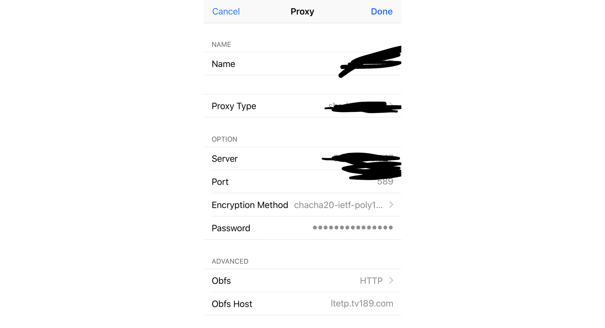

#### Shadowrocket

shadowrocket在服务器的编辑页面中即可设置混淆

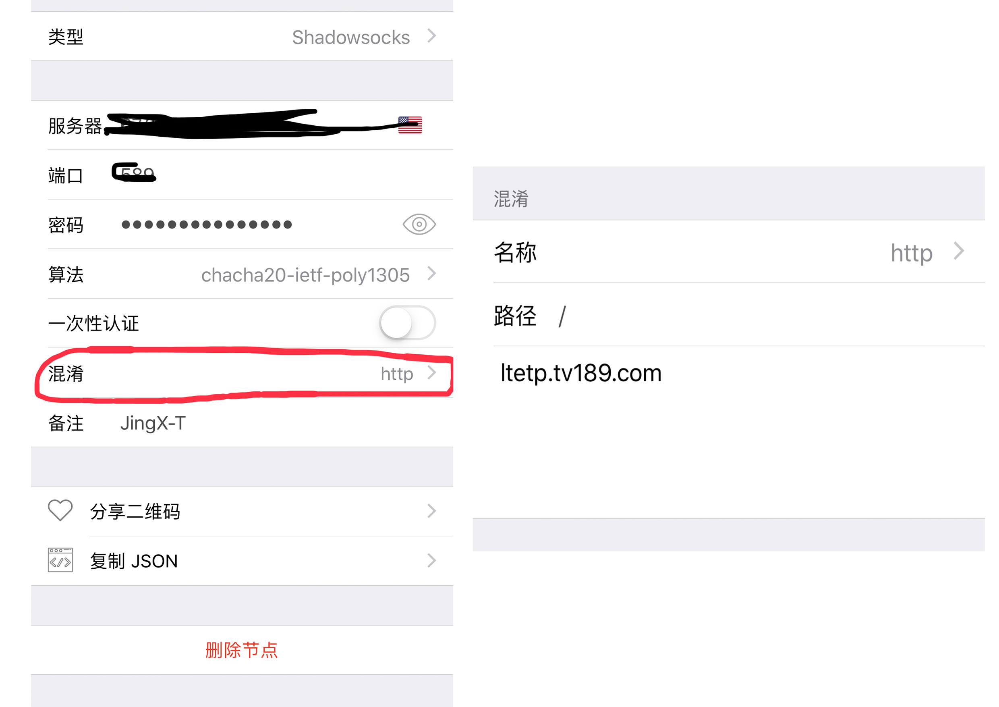

### Android

#### Shadowsocks

推荐在Google Play上下载Shadowsocks app, 同时下载obfs插件, 开发者均为 Max Lv. 

也可以前往 [Shadowsocks-Android](https://github.com/shadowsocks/shadowsocks-android/releases) 的 GitHub 仓库下载。

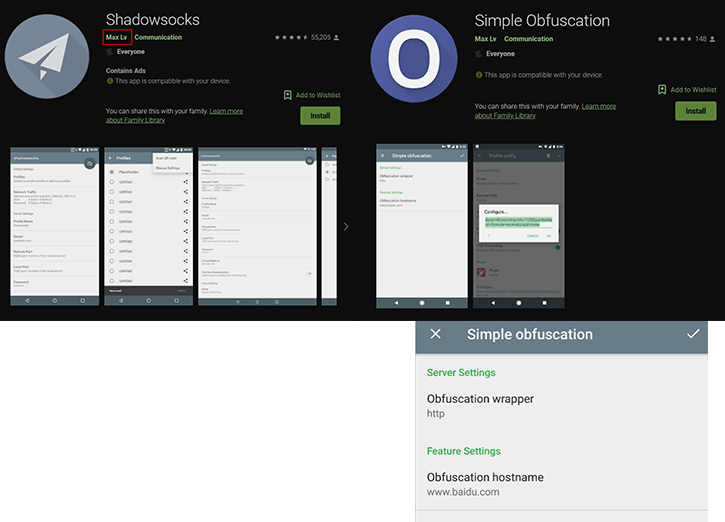

#### Postern 

Postern 目前尚不支持混淆模式。
